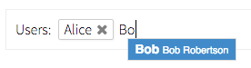

# Tokens Input

Text input that tokenifies the values (eg tags, recipients).
Uses [suggest-box](https://www.npmjs.com/package/suggest-box).



```jsx
import TokensInput from 'patchkit-tokens-input'

const suggestOptions = [
  { title: 'Alice', subtitle: 'Alice Allison', value: 1 },
  { title: 'Bob',   subtitle: 'Bob Robertson', value: 2 },
  { title: 'Carla', subtitle: 'Carla Carlson', value: 3 },
  { title: 'Dan',   subtitle: 'Dan Dannison',  value: 4 }
]

const onAdd = listKey => t => {
  // find and add to list
  if (this.state.tokens.filter(t2 => t.value == t2.value).length === 0)
    this.state.tokens.push(t)
  this.setState(this.state)
}
const onRemove = listKey => t => {
  // find and remove form list
  var i = this.state.tokens.indexOf(t)
  if (i !== -1)
    this.state.tokens.splice(i, 1)
  this.setState(this.state)
}

// Standard usage:

<TokensInput
  label="Users:"
  placeholder="Enter user names here"
  suggestOptions={suggestOptions}
  tokens={this.state.tokens}
  onAdd={onAdd}
  onRemove={onRemove} />

// Allow 'arbitrary' inputs (not suggested):

<TokensInput
  allowArbitrary
  label="Users:"
  placeholder="Enter user names here"
  suggestOptions={suggestOptions}
  tokens={this.state.tokens}
  onAdd={onAdd}
  onRemove={onRemove} />

// Enforce a token limit:

<TokensInput
  limit=2
  limitErrorMsg="Limit reached" 
  label="Users:"
  placeholder="Enter user names here"
  suggestOptions={suggestOptions}
  tokens={this.state.tokens}
  onAdd={onAdd}
  onRemove={onRemove} />

// Read-only:

<TokensInput
  readOnly
  label="Users:"
  tokens={this.state.tokens} />
```

## Styles

Use the .less file:

```less
@import "node_modules/patchkit-tokens-input/styles.less"
```

If you don't have suggest-box styles yet, include the following:

```less
@import "node_modules/patchkit-tokens-input/suggest-box.less"
```